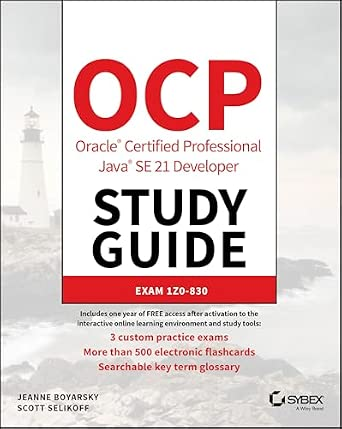

# Java-SE25-Exam
Notes to support the Oracle 1Z0-831 Java 25 SE Developer exam.

## JDK 21 Base
My base learning is from [OCP Oracle Certified Professional Java SE 21 Developer Study Guide: Exam 1z0-830](https://www.amazon.co.uk/Oracle-Certified-Professional-Developer-Study/dp/1394286619) via [O'Reilly](https://learning.oreilly.com/library/view/ocp-oracle-certified/9781394286614/).
This breaks the syllabus into 14 chapters.

### Chapters

| Chapter | README | Assessment | Description |
|---------|--------|------------|-------------|
| 00 - Assessment | [README](src/rysharp/base/chapter/_00_Assessment/README.md) | [Pre-Assessment](src/rysharp/base/chapter/_00_Assessment/preassessment.md) | Pre-Assessment |
| 01 - Building Blocks | [README](src/rysharp/base/chapter/_01_Building_Blocks/README.md) | [Assessment](src/rysharp/base/chapter/_01_Building_Blocks/assessment.md) | Java basics, variables, flow |
| 02 - Operators | [README](src/rysharp/base/chapter/_02_Operators/README.md) | [Assessment](src/rysharp/base/chapter/_02_Operators/assessment.md) | Operators and expressions |
| 03 - Making Decisions | [README](src/rysharp/base/chapter/_03_Making_Decisions/README.md) | [Assessment](src/rysharp/base/chapter/_03_Making_Decisions/assessment.md) | Conditionals, switch, loops |
| 04 - Core APIs | [README](src/rysharp/base/chapter/_04_Core_APIs/README.md) | [Assessment](src/rysharp/base/chapter/_04_Core_APIs/assessment.md) | Strings, arrays, dates |
| 05 - Methods | [README](src/rysharp/base/chapter/_05_Methods/README.md) | [Assessment](src/rysharp/base/chapter/_05_Methods/assessment.md) | Methods, parameters |
| 06 - Class Design | [README](src/rysharp/base/chapter/_06_Class_Design/README.md) | [Assessment](src/rysharp/base/chapter/_06_Class_Design/assessment.md) | Classes, inheritance |
| 07 - Beyond Classes | [README](src/rysharp/base/chapter/_07_Beyond_Classes/README.md) | [Assessment](src/rysharp/base/chapter/_07_Beyond_Classes/assessment.md) | Abstract, sealed, records |
| 08 - Lambdas & Functional Interfaces | [README](src/rysharp/base/chapter/_08_Lambdas_and_Functional_Interfaces/README.md) | [Assessment](src/rysharp/base/chapter/_08_Lambdas_and_Functional_Interfaces/assessment.md) | Lambdas, functional APIs |
| 09 - Collections & Generics | [README](src/rysharp/base/chapter/_09_Collections_and_Generics/README.md) | [Assessment](src/rysharp/base/chapter/_09_Collections_and_Generics/assessment.md) | Collections, generics |
| 10 - Streams | [README](src/rysharp/base/chapter/_10_Streams/README.md) | [Assessment](src/rysharp/base/chapter/_10_Streams/assessment.md) | Streams, pipelines |
| 11 - Exceptions & Localisation | [README](src/rysharp/base/chapter/_11_Exceptions_and_Localisation/README.md) | [Assessment](src/rysharp/base/chapter/_11_Exceptions_and_Localisation/assessment.md) | Exceptions, localisation |
| 12 - Modules | [README](src/rysharp/base/chapter/_12_Modules/README.md) | [Assessment](src/rysharp/base/chapter/_12_Modules/assessment.md) | Java modules |
| 13 - Concurrency | [README](src/rysharp/base/chapter/_13_Concurrency/README.md) | [Assessment](src/rysharp/base/chapter/_13_Concurrency/assessment.md) | Threads, concurrency |
| 14 - Input/Output | [README](src/rysharp/base/chapter/_14_Input_Output/README.md) | [Assessment](src/rysharp/base/chapter/_14_Input_Output/assessment.md) | Input/Output |
| Summary | - | [Assessment Summary](src/rysharp/base/chapter/_00_Assessment/assessment_summary.md) | Overall scores and stats |

## JDK 25 Addendum
An addendum for additions introduced across JDK 22–25 that show up in
the 1Z0-831 exam objectives.

| Feature | Description | README |
|---------|-------------|--------|
| Flexible Constructor Bodies (JEP 513) | Allows statements in constructor before `super()` or `this()`. | [README](src/rysharp/addendum/Flexible_Constructor_Bodies/README.md) |
| Unnamed Variables and Patterns (_) | Use `_` for unused variables. | [README](src/rysharp/addendum/Unnamed_Variables/README.md) |
| Module Import Declarations (JEP 511) | `import module java.base;` | [README](src/rysharp/addendum/Module_Import_Declarations/README.md) |
| Compact Source Files and Instance Main Methods (JEP 512) | Streamlined main methods. | [README](src/rysharp/addendum/Compact_Source_Files_and_Instance_Main_Methods/README.md) |
| Stream Gatherers | Flexible intermediate operations. | [README](src/rysharp/addendum/Stream_Gatherers/README.md) |
| Scoped Values (JEP 506) | Immutable alternative to thread-local variables. | [README](src/rysharp/addendum/Scoped_Values/README.md) |
| Minor API Additions | Various small updates. | [README](src/rysharp/addendum/Minor_Api_Additions/README.md) |

For a comprehensive breakdown of the platform updates, you can check the [Oracle JDK 25 Release Notes](https://www.oracle.com/asean/java/technologies/javase/25-relnote-issues.html).

For tracking the exact exam blueprint changes against Java 21, the [Enthuware OCP Java 25 Resources Page](https://enthuware.com/ocajp-8-fundamentals/114-resources/ocajp-ocpjp-resources) maps out the line-by-line topic differences.

## Additional Study Material

### Udemy

[Java 25 Professional Certification - 6 full Tests (1Z0-831)](https://www.udemy.com/course/ocp-oracle-certified-professional-java-developer-prep/)
