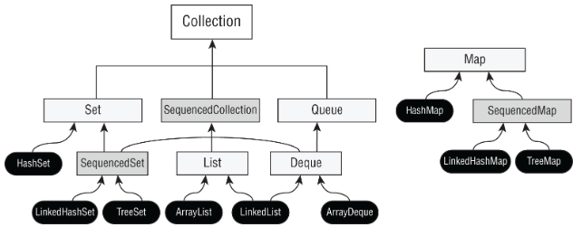

# Collections

Quick reference for the Java Collections Framework hierarchy, ordering, comparison, sorting, searching, factory methods and `Collections` utility methods.

## Contents

- [Collections Framework](#collections-framework)
- [Sequenced Collections](#sequenced-collections)
- [Comparable](#comparable)
- [Comparator](#comparator)
- [Sorting](#sorting)
- [Binary Search](#binary-search)
- [Collections Utility Methods](#collections-utility-methods)
- [Collection Factory Methods](#collection-factory-methods)
- [Singleton Collections](#singleton-collections)
- [Unmodifiable Collections](#unmodifiable-collections)
- [Quick Reference](#quick-reference)
- [Final Memory Kicks](#final-memory-kicks)

---

## Collections Framework

The Java Collections Framework provides interfaces and implementations for storing and manipulating groups of objects.



At the top of the main collection hierarchy is:

```java
Collection<E>
```

Its major branches include:

```text
Collection
├── Set
├── SequencedCollection
│   ├── SequencedSet
│   └── List
└── Queue
    └── Deque
```

`Map` is separate:

```text
Map
└── SequencedMap
```

A `Map` is **not** a `Collection`.

Important implementations include:

```text
List
├── ArrayList
└── LinkedList

Set
├── HashSet
├── LinkedHashSet
└── TreeSet

Queue / Deque
├── LinkedList
└── ArrayDeque

Map
├── HashMap
├── LinkedHashMap
└── TreeMap
```

The individual collection families are covered separately:

- **List**
- **Set**
- **Queue & Deque**
- **Map**

This guide focuses on behaviour shared across the framework and general-purpose collection APIs.

---

## Sequenced Collections

Java 21 introduced interfaces representing collections with a defined **encounter order**:

```java
SequencedCollection<E>
SequencedSet<E>
SequencedMap<K,V>
```

They formalise operations involving the first and last elements of ordered collections.

### `SequencedCollection`

Important methods include:

```java
addFirst(E)
addLast(E)

getFirst()
getLast()

removeFirst()
removeLast()

reversed()
```

Conceptually:

```text
FIRST ← collection → LAST
```

For example:

```java
List<String> list =
        new ArrayList<>(List.of("B", "C"));

list.addFirst("A");
list.addLast("D");

System.out.println(list.getFirst()); // A
System.out.println(list.getLast());  // D
```

Because `List` extends `SequencedCollection`, these operations are available through `List`.

### `reversed()`

```java
SequencedCollection<String> reversed =
        list.reversed();
```

`reversed()` provides a **reverse-ordered view**.

It does not simply create an unrelated reversed copy.

Changes can therefore be visible through both views.

### `SequencedSet`

`SequencedSet` combines:

```text
Set
+
SequencedCollection
```

It therefore represents a set with a defined encounter order.

Examples include:

```text
LinkedHashSet
TreeSet
```

### `SequencedMap`

`SequencedMap` provides encounter-order operations for maps.

Important methods include:

```java
firstEntry()
lastEntry()

pollFirstEntry()
pollLastEntry()

putFirst()
putLast()

reversed()
```

Examples include:

```text
LinkedHashMap
TreeMap
```

The collection-specific guides cover the behaviour of these implementations in more detail.

---

## Comparable

`Comparable<T>` defines a type's **natural ordering**.

A class implements:

```java
Comparable<T>
```

and overrides:

```java
int compareTo(T other)
```

Example:

```java
class Person implements Comparable<Person> {

    private int age;

    Person(int age) {
        this.age = age;
    }

    @Override
    public int compareTo(Person other) {
        return Integer.compare(age, other.age);
    }
}
```

The result means:

```text
negative → this comes BEFORE other

zero     → equal for ordering

positive → this comes AFTER other
```

Do not rely on specific values such as `-1` and `1`.

Only the **sign** matters.

### Natural ordering

If a class implements `Comparable`, APIs can use its natural ordering without being given a separate comparator.

```java
Collections.sort(list);
```

or:

```java
list.sort(null);
```

Passing `null` as the comparator means:

```text
use natural ordering
```

---

## Comparator

`Comparator<T>` defines an ordering **outside the class being compared**.

Its functional method is:

```java
int compare(T a, T b)
```

Example:

```java
Comparator<Person> byAge =
        (a, b) -> Integer.compare(a.getAge(), b.getAge());
```

Unlike `Comparable`, a class can have many different comparators.

```java
Comparator<Person> byAge = ...;
Comparator<Person> byName = ...;
Comparator<Person> byHeight = ...;
```

### `Comparable` vs `Comparator`

| | `Comparable` | `Comparator` |
|---|---|---|
| Package | `java.lang` | `java.util` |
| Method | `compareTo(T)` | `compare(T,T)` |
| Parameters | 1 | 2 |
| Purpose | Natural ordering | External/custom ordering |
| Implemented by | Object being sorted | Separate comparator |

Memory:

```text
Comparable
OBJECT compares TO another object
compareTo()

Comparator
COMPARATOR compares TWO objects
compare()
```

---

## Comparator Convenience Methods

Comparators can often be created without manually writing comparison logic.

### `comparing()`

```java
Comparator<Person> byName =
        Comparator.comparing(Person::getName);
```

### `comparingInt()`

```java
Comparator<Person> byAge =
        Comparator.comparingInt(Person::getAge);
```

Primitive variants include:

```java
comparingInt()
comparingLong()
comparingDouble()
```

### `thenComparing()`

Used for secondary ordering:

```java
Comparator<Person> comparator =
        Comparator.comparing(Person::getLastName)
                  .thenComparing(Person::getFirstName);
```

Think:

```text
sort by last name
THEN
sort equal last names by first name
```

### `reversed()`

```java
Comparator<Person> descending =
        Comparator.comparingInt(Person::getAge)
                  .reversed();
```

### `naturalOrder()` and `reverseOrder()`

```java
Comparator.naturalOrder()
Comparator.reverseOrder()
```

### Null handling

```java
Comparator.nullsFirst(comparator)
Comparator.nullsLast(comparator)
```

These explicitly define where `null` values should appear.

---

## Sorting

Two common sorting APIs are:

```java
Collections.sort(list);
Collections.sort(list, comparator);
```

and:

```java
list.sort(comparator);
```

### Natural ordering

```java
List<Integer> numbers =
        new ArrayList<>(List.of(4, 1, 3, 2));

Collections.sort(numbers);
```

Result:

```text
[1, 2, 3, 4]
```

### Comparator ordering

```java
Collections.sort(numbers, Comparator.reverseOrder());
```

Result:

```text
[4, 3, 2, 1]
```

Equivalent style:

```java
numbers.sort(Comparator.reverseOrder());
```

### `List.sort()`

```java
list.sort(comparator);
```

Passing:

```java
list.sort(null);
```

uses natural ordering.

---

## Binary Search

`Collections.binarySearch()` searches a sorted `List`.

This follows the same binary-search rules as `Arrays.binarySearch()` covered in
[Array Operations](../_04_Core_APIs/array_operations.md#arraysbinarysearch):

- The data must already be sorted using the same ordering used by the search.
- If found, the result is an index `>= 0`.
- If not found, the result is:

  `-(insertion point) - 1`

Recover the insertion point with:

`-result - 1`

---

## Collections Utility Methods

`java.util.Collections` provides static utility methods for working with collections.

Do not confuse:

```java
Collection
```

with:

```java
Collections
```

```text
Collection
→ interface

Collections
→ utility class
```

### `sort()`

```java
Collections.sort(list);
Collections.sort(list, comparator);
```

Sorts the supplied list.

---

### `reverse()`

```java
Collections.reverse(list);
```

Reverses the existing order.

```text
[A, B, C]
↓
[C, B, A]
```

---

### `shuffle()`

```java
Collections.shuffle(list);
```

Randomly permutes the elements.

---

### `swap()`

```java
Collections.swap(list, 0, 2);
```

Swaps the elements at the two indexes.

---

### `min()` / `max()`

```java
Collections.min(collection);
Collections.max(collection);
```

Use natural ordering.

Comparator overloads are also available:

```java
Collections.min(collection, comparator);
Collections.max(collection, comparator);
```

---

### `frequency()`

```java
Collections.frequency(collection, object);
```

Returns the number of elements equal to the supplied object.

```java
List<String> values =
        List.of("A", "B", "A");

Collections.frequency(values, "A");
```

Result:

```text
2
```

---

### `disjoint()`

```java
List<String> a = List.of("A", "B", "C");
List<String> b = List.of("X", "Y", "Z");

System.out.println(Collections.disjoint(a, b)); // true
```
Returns true if the two collections have no elements in common.

If they share even one element:

```
List<String> a = List.of("A", "B", "C");
List<String> b = List.of("C", "X", "Y");

System.out.println(Collections.disjoint(a, b)); // false
```
"C" occurs in both collections, so they are **not disjoint**.

```text
NO overlap → true
ANY overlap → false
```

---

### `copy()`

```java
Collections.copy(destination, source);
```

Copies source elements into an **existing destination list**.

Important:

```text
SOURCE → DESTINATION
```

The destination must already be large enough.

This fails (with `IndexOutOfBoundsException` at runtime):

```java
List<String> source =
        List.of("A", "B");

List<String> destination =
        new ArrayList<>();

Collections.copy(destination, source);
```

The destination has size `0`.

Its capacity is irrelevant. E.g. `List<String> destination = new ArrayList<>(10);` will still result in an `IndexOutOfBoundsException`.

A valid example:

```java
List<String> source =
        List.of("A", "B");

List<String> destination =
        new ArrayList<>(List.of("X", "Y", "Z"));

Collections.copy(destination, source);
```

Result:

```text
[A, B, Z]
```

`copy()` replaces existing elements.

It does not append them.

### Memory

```text
Collections.copy(DESTINATION, SOURCE)

destination.size() >= source.size()
```

---

### `fill()`

```java
Collections.fill(list, value);
```

Replaces every existing element with the supplied value.

```text
[A, B, C]

fill("X")

[X, X, X]
```

---

### `replaceAll()`

```java
Collections.replaceAll(list, oldValue, newValue);
```

Replaces matching elements.

---

### Utility summary

| Method | Purpose |
|---|---|
| `sort()` | Sort list |
| `binarySearch()` | Search sorted list |
| `reverse()` | Reverse order |
| `shuffle()` | Randomise order |
| `swap()` | Swap two positions |
| `min()` | Smallest element |
| `max()` | Largest element |
| `frequency()` | Count matching elements |
| `disjoint()` | Test for no common elements |
| `copy()` | Replace destination positions from source |
| `fill()` | Replace every element |
| `replaceAll()` | Replace matching values |

---

## Collection Factory Methods

Several interfaces provide static factory methods.

### `List.of()`

```java
List<String> list =
        List.of("A", "B", "C");
```

### `Set.of()`

```java
Set<String> set =
        Set.of("A", "B", "C");
```

### `Map.of()`

```java
Map<String, Integer> map =
        Map.of(
            "A", 1,
            "B", 2
        );
```

For larger maps:

```java
Map.ofEntries(
    Map.entry("A", 1),
    Map.entry("B", 2)
);
```

Collections produced by `of()` cannot be structurally modified.

For example:

```java
list.add("D");       // UnsupportedOperationException
list.remove("A");    // UnsupportedOperationException
```

### Nulls

The `of()` factory methods reject `null`.

For example:

```java
List.of("A", null);      // NullPointerException
```

---

## Singleton Collections

`Collections` provides methods for creating collections containing exactly one element.

```java
Collections.singleton(value)

Collections.singletonList(value)

Collections.singletonMap(key, value)
```

Examples:

```java
Set<String> set =
        Collections.singleton("A");

List<String> list =
        Collections.singletonList("A");

Map<String, Integer> map =
        Collections.singletonMap("A", 1);
```

These collections are immutable with respect to their contents.

For example:

```java
list.add("B");       // UnsupportedOperationException
list.set(0, "B");    // UnsupportedOperationException
```

Do not confuse:

```java
Collections.singletonList("A")
```

with:

```java
List.of("A")
```

Both produce a one-element unmodifiable list, but they are separate APIs.

---

## Unmodifiable Collections

There are several APIs that can produce collections that cannot be modified through a particular reference.

It is important to distinguish an **unmodifiable view** from an independent collection.

### Unmodifiable views

```java
List<String> original =
        new ArrayList<>();

List<String> view =
        Collections.unmodifiableList(original);
```

This fails:

```java
view.add("A");       // UnsupportedOperationException
```

But the backing collection can still change:

```java
original.add("A");

System.out.println(view);
```

Output:

```text
[A]
```

The view reflects changes to the backing collection.

Equivalent methods include:

```java
Collections.unmodifiableCollection()
Collections.unmodifiableList()
Collections.unmodifiableSet()
Collections.unmodifiableMap()
```

### `copyOf()`

Modern collection interfaces also provide:

```java
List.copyOf(collection)
Set.copyOf(collection)
Map.copyOf(map)
```

These create unmodifiable collections from existing data rather than an unmodifiable wrapper view over the supplied collection.

Example:

```java
List<String> original =
        new ArrayList<>(List.of("A"));

List<String> copy =
        List.copyOf(original);

original.add("B");

System.out.println(copy);
```

Output:

```text
[A]
```

The copy does not reflect the later structural change to `original`.

### Memory

```text
Collections.unmodifiableX(original)
→ unmodifiable VIEW
→ backing collection can still change

List.copyOf(original)
Set.copyOf(original)
Map.copyOf(original)
→ unmodifiable result
→ later changes to original are not reflected
```

---

## Quick Reference

### Framework

```text
Collection
├── Set
├── SequencedCollection
│   ├── SequencedSet
│   └── List
└── Queue
    └── Deque

Map
└── SequencedMap
```

```text
Map IS NOT a Collection
```

### Comparison

```text
Comparable<T>
compareTo(T)
natural ordering
ONE parameter
```

```text
Comparator<T>
compare(T, T)
custom ordering
TWO parameters
```

### Comparator helpers

```text
comparing()
comparingInt()
comparingLong()
comparingDouble()

thenComparing()
reversed()

naturalOrder()
reverseOrder()

nullsFirst()
nullsLast()
```

### Sorting

```java
Collections.sort(list);
Collections.sort(list, comparator);

list.sort(comparator);
list.sort(null);              // natural ordering
```

### Binary search

```text
FOUND
→ index >= 0

NOT FOUND
→ -(insertion point) - 1
```

```text
SORT and SEARCH must use the same ordering.
```

### `Collections`

```text
sort
binarySearch

reverse
shuffle
swap

min
max

frequency
disjoint

copy
fill
replaceAll
```

### `copy()`

```text
Collections.copy(DESTINATION, SOURCE)

destination must already be large enough
```

### Factories

```text
List.of(...)
Set.of(...)
Map.of(...)
Map.ofEntries(...)
```

```text
unmodifiable
null rejected
```

### Singleton

```text
Collections.singleton(x)
Collections.singletonList(x)
Collections.singletonMap(k, v)
```

### Unmodifiable

```text
Collections.unmodifiableX(...)
→ VIEW
```

```text
List.copyOf(...)
Set.copyOf(...)
Map.copyOf(...)
→ independent unmodifiable result
```

---

## Final Memory Kicks

```text
Collection = INTERFACE
Collections = UTILITY CLASS
```

```text
Map ≠ Collection
```

```text
Comparable
compareTo()
NATURAL ORDER

Comparator
compare()
CUSTOM ORDER
```

```text
COMPARE RESULT:
negative → BEFORE
zero     → SAME ORDER
positive → AFTER
```

```text
Binary search:
FOUND     → index
NOT FOUND → -insertionPoint - 1
```

```text
Collections.copy(DESTINATION, SOURCE)
```

```text
copy() needs destination SIZE
not destination CAPACITY
```

```text
unmodifiableX()
→ VIEW

copyOf()
→ unmodifiable COPY
```

```text
Sequenced
→ defined encounter order
→ FIRST / LAST / REVERSED
```