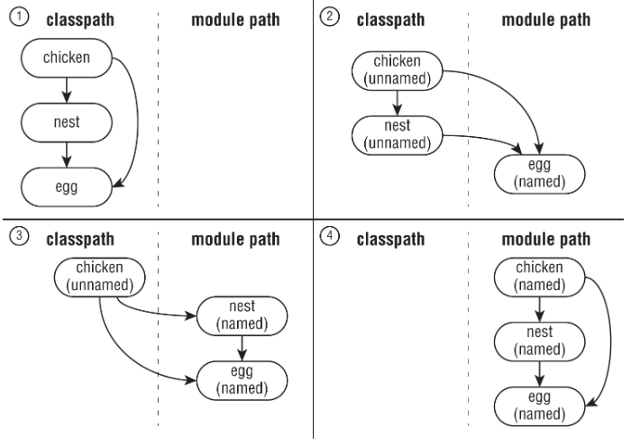
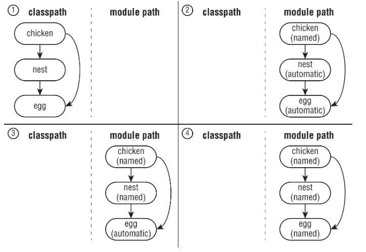

# Java Modules

[🔙 Back](README.md)

A quick reference for JPMS module types, directives, services and migration.

For compilation, execution, dependency analysis and packaging commands, see
[Java Module Commands](<Java Module Commands.md>).

## Contents

- [Module Descriptor](#module-descriptor)
- [Module Directives](#module-directives)
- [Module Types](#module-types)
- [Automatic Module Names](#automatic-module-names)
- [Readability and Accessibility](#readability-and-accessibility)
- [Services](#services)
- [Migration](#migration)
- [Quick Reference](#quick-reference)
- [Final Memory Kicks](#final-memory-kicks)

---

## Module Descriptor

A named module declares its dependencies and accessibility rules using:

```text
module-info.java
```

Example:

```java
module com.example.zoo {
    requires com.example.food;
    exports com.example.zoo.api;
}
```

After compilation, the descriptor becomes `module-info.class`.

A module descriptor can also declare service usage and provision.

---

## Module Directives

| Directive | Purpose | Memory |
|---|---|---|
| `requires` | Reads another module | Dependency |
| `requires transitive` | Propagates readability to modules requiring this one | Through |
| `requires static` | Compile-time dependency, optional at runtime | Compile |
| `exports` | Makes a package accessible to other modules | Normal access |
| `opens` | Enables deep reflective access | Reflection |
| `uses` | Declares service consumption | Looking for |
| `provides ... with` | Registers service implementation | Supplying |

### Requires

```java
requires com.example.food;
```

A qualified dependency is not supported; `requires` names a module.

```java
requires transitive com.example.food;
```

Modules reading this module also read `com.example.food`.

```java
requires static com.example.optional;
```

The dependency is required at compile time but optional at runtime.

### Exports

```java
exports com.example.zoo.api;
```

Exports a package to all modules that read this module.

```java
exports com.example.zoo.internal to com.example.staff;
```

Qualified export: only the specified module can access the exported package.

### Opens

```java
opens com.example.zoo.model;
```

Permits deep reflective access.

```java
opens com.example.zoo.model to com.example.framework;
```

Qualified opening.

An entire module may be open:

```java
open module com.example.zoo {
    requires com.example.food;
}
```

An `open module` implicitly opens all its packages for deep reflection.

### Uses and Provides

```java
uses com.example.zoo.api.Tour;
```

Declares a service consumer.

```java
provides com.example.zoo.api.Tour
    with com.example.zoo.impl.DayTour;
```

Registers a provider implementation.

---

## Module Types

| Type | Descriptor | Location | Name |
|---|---|---|---|
| Explicit named | `module-info.class` | Module path | Declared |
| Automatic | No descriptor | Module path | Manifest or filename |
| Unnamed | No descriptor | Classpath | None |

An automatic module is technically also a named module.

### Explicit Named Module

```java
module com.example.zoo {
    exports com.example.zoo.api;
}
```

The descriptor explicitly declares the module name and relationships.

### Automatic Module

A non-modular JAR placed on the module path becomes an automatic module.

```text
legacy-library.jar
        ↓ module path
AUTOMATIC MODULE
```

Automatic modules:

- Have module names.
- Export and open all their packages.
- Read all other resolved modules, including the unnamed module.
- Allow explicitly named modules to depend on legacy JARs.

They provide compatibility during migration.

### Unnamed Module

Classes and JARs on the classpath belong to the unnamed module.

```text
classpath
→ UNNAMED MODULE
```

The unnamed module:

- Has no name.
- Reads all resolved modules.
- Exports and opens all its packages.
- Cannot be named in a `requires` directive.

An explicitly named module therefore cannot directly require a classpath dependency.

---

## Automatic Module Names

Java determines an automatic module's name from either its manifest or filename.

### Manifest

```text
Automatic-Module-Name: com.example.legacy
```

The manifest provides a stable name.

### Filename

Without the manifest entry, Java derives a name.

```text
cats-1.2.jar
→ cats

awesome-cats-1.2.jar
→ awesome.cats
```

Rules:

1. Remove `.jar`.
2. Remove the version suffix starting with a hyphen followed by a digit.
3. Replace non-alphanumeric characters with dots.
4. Collapse consecutive dots.
5. Remove leading/trailing dots.

Priority:

```text
EXPLICIT DESCRIPTOR
→ declared module name

NO DESCRIPTOR + MANIFEST NAME
→ Automatic-Module-Name

NO DESCRIPTOR + NO MANIFEST NAME
→ filename-derived name
```

A manifest name alone does not make a JAR an explicit module.

---

## Readability and Accessibility

Two separate conditions determine whether code in one module can access a public type in another.

### Readability

```java
requires com.example.food;
```

Establishes a dependency.

### Accessibility

```java
exports com.example.food.api;
```

Exposes a package to other modules.

```text
requires
→ Can I READ the module?

exports
→ Can I ACCESS its package?
```

A public class in an unexported package is not ordinarily accessible from another named module.

### Transitive Readability

```java
module food {
    requires transitive ingredients;
}
```

A module requiring `food` also reads `ingredients`.

This does not automatically export every package in `ingredients`; package accessibility still matters.

### Qualified Exports

```java
exports com.example.internal to com.example.admin;
```

Only `com.example.admin` receives that export.

### Reflection

```text
exports
→ ordinary public-type access

opens
→ deep reflection
```

`opens` does not substitute for `exports` when ordinary source-code access is required.

---

## Services

Java services allow consumers to discover implementations without depending directly on concrete provider classes.

### Four Components

The book's zoo example separates the architecture into four roles:

```text
                     SERVICE
┌───────────────────────────────────────┐
│                                       │
│  zoo.tours.api                        │
│  Service Provider Interface           │
│                                       │
│  zoo.tours.reservations               │
│  Service Locator                      │
│                                       │
└───────────────────────────────────────┘

zoo.visitor       → Consumer
zoo.tours.agency  → Service Provider
```

| Component | Module | Responsibility |
|---|---|---|
| Provider Interface | `zoo.tours.api` | Defines the contract |
| Service Locator | `zoo.tours.reservations` | Finds implementations |
| Consumer | `zoo.visitor` | Uses the service |
| Service Provider | `zoo.tours.agency` | Implements the contract |

In this example, the interface and locator make up the service.

The four roles need not always be separate modules.

### Service Provider Interface

Defines the contract:

```java
package zoo.tours.api;

public interface Tour {
    String name();
    int length();
}
```

Descriptor:

```java
module zoo.tours.api {
    exports zoo.tours.api;
}
```

**Directive: `exports`**

### Service Locator

Uses `ServiceLoader` to discover implementations.

```java
package zoo.tours.reservations;

import java.util.ServiceLoader;
import zoo.tours.api.Tour;

public class TourFinder {

    public static Tour findSingleTour() {
        for (Tour tour : ServiceLoader.load(Tour.class))
            return tour;

        return null;
    }
}
```

Descriptor:

```java
module zoo.tours.reservations {
    exports zoo.tours.reservations;
    requires zoo.tours.api;
    uses zoo.tours.api.Tour;
}
```

**Directives: `exports`, `requires`, `uses`**

```text
exports
→ exposes locator

requires
→ needs interface module

uses
→ looks up implementations
```

### ServiceLoader API

```java
ServiceLoader<Tour> loader =
        ServiceLoader.load(Tour.class);
```

`ServiceLoader` implements `Iterable<Tour>`.

Alternatively:

```java
import java.util.ServiceLoader.Provider;
```

```java
ServiceLoader.load(Tour.class)
        .stream()
        .map(Provider::get)
        .mapToInt(Tour::length)
        .max()
        .ifPresent(System.out::println);
```

Return-type distinction:

```text
ServiceLoader.load(Tour.class)
→ ServiceLoader<Tour>

loader.stream()
→ Stream<Provider<Tour>>

Provider.get()
→ Tour instance
```

There may be zero, one or multiple implementations.

### Consumer

Uses the service locator.

```java
package zoo.visitor;

import zoo.tours.api.Tour;
import zoo.tours.reservations.TourFinder;

public class Tourist {

    public static void main(String[] args) {
        Tour tour = TourFinder.findSingleTour();

        if (tour != null)
            System.out.println(tour.name());
    }
}
```

Descriptor:

```java
module zoo.visitor {
    requires zoo.tours.api;
    requires zoo.tours.reservations;
}
```

**Directive: `requires`**

The consumer does not need `uses` because the locator performs the lookup.

If the consumer called `ServiceLoader.load()` directly, it would need its own `uses` directive.

### Service Provider

Implements the contract.

```java
package zoo.tours.agency;

import zoo.tours.api.Tour;

public class TourImpl implements Tour {

    public String name() {
        return "Behind the Scenes";
    }

    public int length() {
        return 120;
    }
}
```

Descriptor:

```java
module zoo.tours.agency {
    requires zoo.tours.api;

    provides zoo.tours.api.Tour
        with zoo.tours.agency.TourImpl;
}
```

**Directives: `requires`, `provides ... with`**

The implementation package need not be exported.

### Service Component Summary

| Component | Part of service? | Required directives |
|---|---|---|
| Provider Interface | Yes | `exports` |
| Service Locator | Yes | `exports`, `requires`, `uses` |
| Consumer | No | `requires` |
| Service Provider | No | `requires`, `provides ... with` |

---

## Migration

JPMS allows gradual migration from classpath applications to modular applications.

```text
CLASSPATH
→ UNNAMED

MODULE PATH without descriptor
→ AUTOMATIC

MODULE PATH with descriptor
→ EXPLICIT NAMED
```

### Bottom-Up Migration

**Dependencies become named modules first; the application migrates last.**



The diagram shows:

1. `chicken`, `nest` and `egg` all on the classpath.
2. `egg` becomes a named module; `chicken` and `nest` remain unnamed.
3. `nest` also becomes named; `chicken` remains unnamed.
4. `chicken` becomes named, completing migration.

```text
BOTTOM-UP
→ dependencies FIRST
→ application LAST
→ unnamed application can temporarily use named dependencies
```

### Top-Down Migration

**The application becomes named first; dependencies migrate later.**



The diagram shows:

1. All three components on the classpath.
2. `chicken` becomes named; `nest` and `egg` become automatic modules.
3. `nest` becomes explicitly named; `egg` remains automatic.
4. All three become explicitly named.

```text
TOP-DOWN
→ dependencies LAST
→ application FIRST
→ automatic modules bridge the migration
```

### Why Automatic Modules Matter

An explicitly named module cannot read the unnamed module, so legacy dependencies must be moved to the module path as automatic modules when migrating the application first.

```text
NAMED APPLICATION
        ↓ requires
AUTOMATIC DEPENDENCY
```

The automatic dependency can later become explicitly named.

### Migration Tool

Use `jdeps` to analyse dependencies and identify internal JDK API usage.

See [Java Module Commands](commands.md#jdeps).

---

## Quick Reference

### Module Types

```text
module-info + module path
→ EXPLICIT NAMED

ordinary JAR + module path
→ AUTOMATIC

classpath
→ UNNAMED
```

### Directives

| Directive | Purpose |
|---|---|
| `requires` | Read module |
| `requires transitive` | Propagate readability |
| `requires static` | Compile-time dependency |
| `exports` | Ordinary access |
| `opens` | Deep reflection |
| `uses` | Discover service |
| `provides ... with` | Register implementation |

### Services

| Role | Directives |
|---|---|
| Interface | `exports` |
| Locator | `exports`, `requires`, `uses` |
| Consumer | `requires` |
| Provider | `requires`, `provides ... with` |

### Migration

| Strategy | First to migrate | Temporary dependencies |
|---|---|---|
| Top-down | Dependencies | Application remains unnamed |
| Bottom-up | Application | Dependencies become automatic |

---

## Final Memory Kicks

```text
MODULE TYPES:

Descriptor
→ EXPLICIT NAMED

Old JAR + MODULE PATH
→ AUTOMATIC

CLASSPATH
→ UNNAMED
```

```text
ACCESS:

requires
→ READ

exports
→ ORDINARY ACCESS

opens
→ REFLECTION
```

```text
SERVICES:

Interface → exports
Locator   → exports + requires + uses
Consumer  → requires
Provider  → requires + provides ... with

SERVICE = Interface + Locator
```

```text
SERVICE LOADER:

load()
→ ServiceLoader<T>

stream()
→ Stream<Provider<T>>

Provider.get()
→ T
```

```text
MIGRATION:

BOTTOM-UP
→ DEPENDENCIES FIRST
→ APPLICATION LAST
→ UNNAMED application during migration

TOP-DOWN
→ APPLICATION FIRST
→ DEPENDENCIES LAST
→ AUTOMATIC dependencies during migration
```